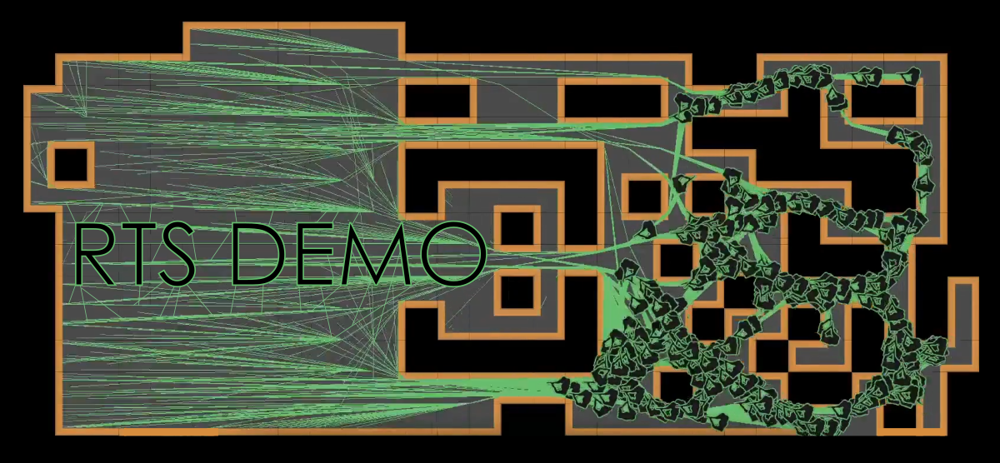
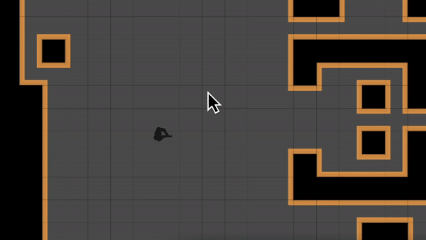
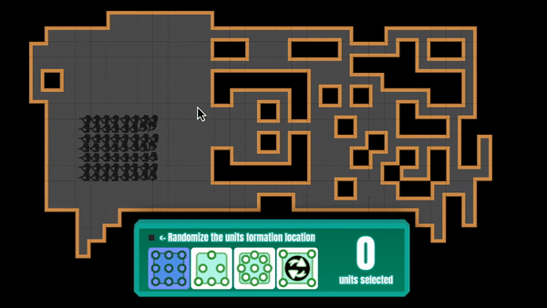

# rts Selection and Movement Demo
A simple DEMO to test selection and move like in RTS games.

## Content

### Selection
In this demo, you can select units with some Control nodes and an Area2D. The esthetic as been customed with the theme asset. When selected, units are changing they underline color.

### Movement 

You can also move your units with a path finding system managed by an auto tiled Tilemap. In the ui, you can click some button to change your unit formation shape (square, circle or triangle).

### Test with parameters

It is possible to change the number of unit that spawn at the begining of the demo.

